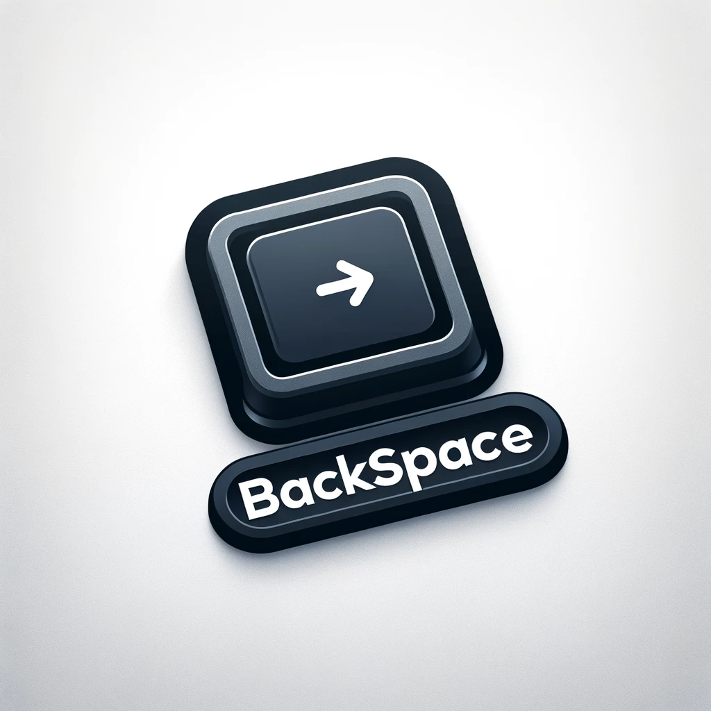

# Backspace
Backspace is a python program made in April by Ierzi.

# Important Commands

If you don't know what to type when the command prompt asks you for a command, type "EDC" for Example Of Commands or Exemple De Commandes.

# Versions

The current version of Backspace is 2.4. You can find the changelog below.

# Changelog

- 2.4: Added 64 Characters Save System
- 2.3: Reorganization
- 2.2: Bugfixing
- 2.1: Bugfixing
- 2.0: Multiple Usages
- 1.0: Initial Release

# Bugs and Help Page

If you need help for anything, go to github.com/Ierzi/Command_Prompt_FR/issues
